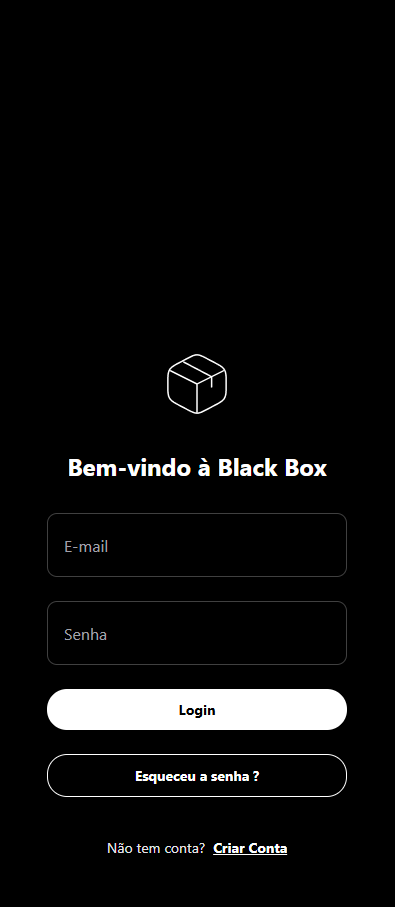
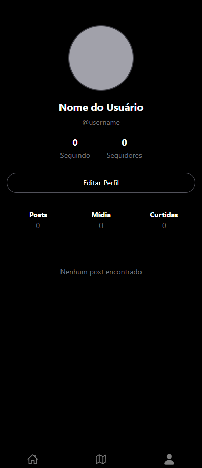

# Black Box Mobile

Aplicativo mobile do projeto **Black Box**, desenvolvido com **React Native**, **Expo**, **Native Base** e arquitetura modular com `hooks`, `services`, `contexts` e suporte a autenticação via **JWT**.

Este app é integrado com o backend RESTful também chamado *Black Box*, e utiliza **IP dinâmico via .env** para garantir funcionamento tanto em ambiente local quanto em dispositivos móveis via **Expo Go**.

---

## ⚙️ Tecnologias Utilizadas

- **React Native**
- **Expo**
- **Native Base**
- **Axios**
- **React Navigation**
- **AsyncStorage**
- **React Context API**

---

## 📁 Estrutura do Projeto

```bash
fblack_box/
├── src/
│   ├── app/                   # Telas e lógica de navegação (Tabs, Auth, etc.)
│   ├── components/            # Componentes reutilizáveis
│   │   ├── home/              # Componentes de página inicial (Hero, Features, etc.)
│   │   └── ui/                # Componentes visuais reutilizáveis (botões, inputs...)
│   ├── config/                # Constantes globais e tema visual (ThemeProvider)
│   ├── hooks/                 # Hooks customizados (useAuth, useFetch...)
│   ├── services/              # Requisições HTTP com axios (authService, userService...)
│   ├── routes/                # Definição de rotas com `expo-router`
│   ├── store/                 # Contextos globais (AuthContext, AppContext...)
│   ├── utils/                 # Funções auxiliares
├── images/                   # Prints das telas principais do app
├── .env                      # Contém API_URL para consumo do backend
├── app.config.js             # Configuração do Expo com dotenv
├── README.md                 # Documentação do projeto
├── CHANGELOG.md              # Histórico de alterações
```

---

## 🌍 Integração com Backend

A API é consumida via `API_URL` presente no `.env`, e a aplicação busca dinamicamente esse valor via:
```js
import Constants from 'expo-constants';
export const API_URL = Constants.expoConfig.extra.API_URL;
```

Isso garante que ao rodar o app via Expo, o IP correto do backend seja configurado.

---

## 🔐 Autenticação com JWT

A autenticação é feita via JWT com suporte a:
- Armazenamento seguro no `AsyncStorage`
- Header `Authorization` automático no axios
- Rotas protegidas (ex: Feed, Perfil)

### Principais arquivos:
- `authService.js`: faz login e cadastro, armazena tokens
- `useAuth.js`: hook para login/logout, validação e contexto
- `AuthContext.js`: contexto global para manter o estado do usuário

---

## 🚀 Como Rodar

1. Clone o repositório
2. Instale as dependências:
```bash
npm install
```

3. Configure o `.env` com o IP da API (obtido do `server.js` do backend):
```env
API_URL=http://192.168.0.100:3000/api
```

4. Rode o app com Expo:
```bash
npx expo start
```

Escaneie o QR Code com o app **Expo Go** no celular conectado à mesma rede.

---

## 📷 Upload de Imagens e Feed

- As imagens dos posts são carregadas do backend via `API_URL.replace('/api', '')`.
- Os endpoints `/reporte/get` e `/reporte/me` são utilizados para listar todos os posts e os posts do usuário, respectivamente.

---

## 📱 Telas do Aplicativo

###  Tela de Login


Tela de autenticação com campos de e-mail e senha, integração com API JWT.

###  Tela de Feed


Listagem de reportes da comunidade, com suporte a imagens, curtidas e comentários.

###  Tela de Mapa (em desenvolvimento)


Esta funcionalidade está em construção e será utilizada para geolocalização dos reportes públicos.

###  Tela de Perfil


Informações do usuário, estatísticas, posts realizados e opção para edição futura.

---

## 🎨 Componentes UI Personalizados

- `AppButton.js`: botão padronizado
- `AppTextInput.js`: input estilizado

---

## 🧪 Exemplo de Login

```bash
POST {API_URL}/auth/login

Body:
{
  "email": "admin@blackbox.com",
  "senha": "admin"
}
```

Tokens são salvos como:
```js
@auth_token
@refresh_token
```

---

## 🛡️ Boas Práticas Aplicadas

- Variáveis de ambiente com `.env`
- Arquitetura modular
- Centralização da lógica HTTP em `services`
- Separado por camadas: `hooks`, `store`, `services`, `components`
- Reutilização visual com `ui/`

---

## 📜 Licença

Este projeto está licenciado sob a licença MIT.